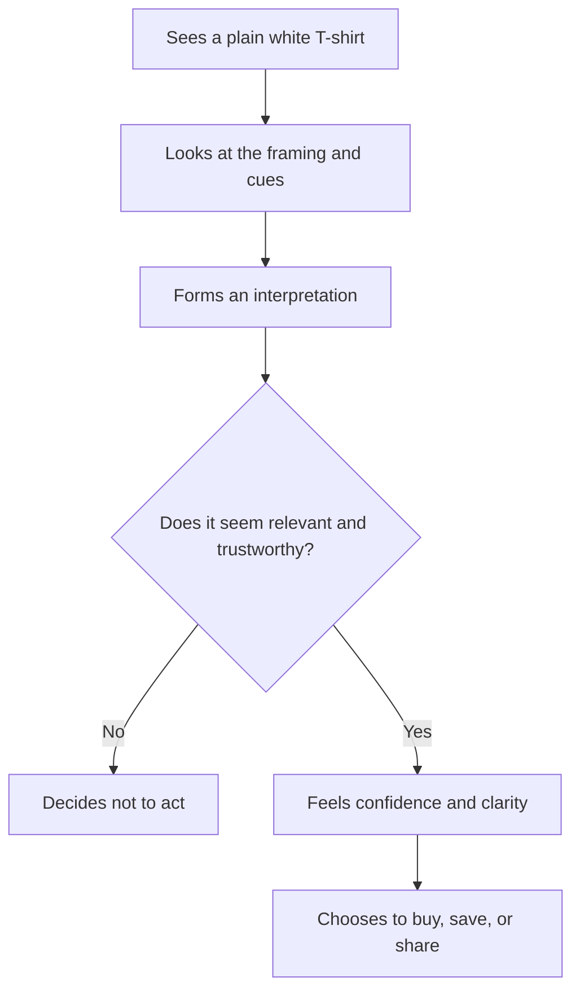

# Chapter 1: Persuasion and Human Decision-Making

Imagine a plain white T-shirt. No logo, no pattern, no obvious story. Now imagine the same shirt in four different settings: a basic household catalog, a luxury fashion photo, a sustainability campaign, and a student club announcement. The garment is the same. The message around it changes. The reaction changes too.

That is the heart of persuasion. A product is not only a material object; it is a bundle of meaning, expectation, and social cues. Designers do not simply make things visible. They shape how someone interprets them, evaluates them, and decides whether to act.

Persuasion, in its ethical form, is a tool for helping people notice what matters, understand why it matters, trust the information, and choose intentionally. It is not the same as coercion or manipulation.

## What Persuasion Does

Persuasion is the effort to influence attention, interpretation, trust, and action through communication. It often works by making a message clearer, more relevant, or more credible. It can help someone see a good reason to care.

For a designer, the important question is not just, “How do I make this persuasive?” It is, “What is the person already trying to decide, and what information helps them decide well?”

A useful way to think about persuasion is in four steps:

- Attention: What does someone notice first?
- Interpretation: What does the message seem to mean?
- Trust: Why should they believe it?
- Action: What do they do next?

A persuasive design does not have to force a decision. It can also make a decision easier to say no to when the offer does not fit.

This is a simplified decision journey. It is not the whole story of human behavior, but it shows why designers cannot treat persuasion as a single moment. It is a sequence of cues and judgments.

## Persuasion, Coercion, and Manipulation

These three ideas are related, but they are not the same.

| Approach | Core method | Effect on choice | Ethical status |
| --- | --- | --- | --- |
| Persuasion | Offers reasons, framing, and trust-building information | Helps someone weigh a decision intentionally | Ethical when honest and respectful |
| Coercion | Uses pressure, threat, or force | Removes meaningful freedom of choice | Unethical |
| Manipulation | Uses hidden influence, deception, or emotional pressure | Exploits confusion, vulnerability, or bias | Unethical |

A persuasive message can be emotionally resonant without being deceptive. A basic T-shirt can be shown in a way that invites appreciation or aspiration. That is not manipulation if the message is truthful and the buyer is free to decide.

Coercion is different. If someone is pressured with fear, threats, or unavoidable consequences, the decision is no longer free. Manipulation is also different because it relies on hiding the real mechanism or exploiting weakness. A designer should not confuse influence with pressure.

## Robert Cialdini's Major Principles of Influence

Robert Cialdini is well known for identifying a set of recurring patterns in human behavior. These are not magical tricks, and they are not guarantees. They are descriptions of common tendencies in people when they are making decisions under time pressure, uncertainty, or social influence.

The six major principles most often discussed are:

| Principle | What it means | Example with a T-shirt | Ethical use | Misuse risk |
| --- | --- | --- | --- | --- |
| Reciprocity | People feel inclined to return a favor or value they receive. | A brand sends a helpful care guide and then invites them to browse a shopping page. | Offer genuine value without obligation. | Guilt-based pressure or exaggerated “free” value. |
| Commitment and consistency | People prefer choices that fit their earlier commitments or values. | Someone who values minimalism may be more willing to buy a simple, durable tee. | Help people act in line with values they genuinely hold. | Trapping someone into a small commitment that leads to larger, unwanted decisions. |
| Social proof | People look to others for guidance, especially when uncertain. | “Most shoppers choose this staple,” or a collection of real customer photos. | Use honest evidence and realistic examples. | Fake reviews, inflated popularity, or crowd pressure. |
| Authority | People trust credentials, expertise, and recognizable authority. | A product page explains material quality by a knowledgeable studio or textile professional. | Use real expertise and be transparent about limits. | Pretending expertise or using status as a substitute for evidence. |
| Liking | People are more receptive to messages from people or brands they find relatable or attractive. | A friendly, clear brand voice and familiar styling. | Build genuine connection and clarity. | Flattery or charm used to bypass real evaluation. |
| Scarcity | People often value things more when they seem limited. | “Last few available in this size” or “limited release.” | Be truthful about real scarcity. | Artificial urgency, fake deadlines, or manufactured shortage. |

These principles help explain why certain marketing choices feel natural to people. But they do not replace good judgment. A persuasive tactic is not automatically good just because it works. A brand that uses scarcity well still needs a product that can justify the price and claim.

## Broader Concepts: Framing and Rhetorical Appeal

Cialdini gives us useful patterns, but persuasion is broader than a checklist. Two additional concepts are especially helpful for designers.

### 1. Framing and Loss Aversion

Framing means presenting the same information in ways that emphasize different interpretations. People often respond more strongly to potential loss than to equivalent gain. This is a classic idea in behavioral economics: the same decision can feel different if it is framed as a missed opportunity rather than a benefit gained.

Consider the same plain white T-shirt:

| Frame | Message | What it emphasizes |
| --- | --- | --- |
| Basic utility | “A dependable shirt for everyday wear.” | Practical value |
| Status and refinement | “An understated piece for a considered wardrobe.” | Prestige and taste |
| Sustainability | “A durable staple made to last, not to be replaced often.” | Responsibility and longevity |
| Identity and culture | “A blank canvas for personal expression.” | Individual or group identity |

The product is the same physical object. The meaning changes because the frame changes. This is not deception; it is the normal process of interpretation. The ethical problem appears when the frame hides key facts, creates false urgency, or suggests a value the product does not actually offer.

### 2. Ethos, Pathos, and Logos

Rhetoric gives us a simple but powerful way to think about persuasion.

- Ethos: credibility and trust
- Pathos: emotional resonance
- Logos: reason and evidence

A persuasive message often needs all three, even if one is more obvious than the others.

For a T-shirt, the message might look like this:

- Ethos: “Made in a small studio with careful material choices.”
- Pathos: “Designed for the feeling of ease and self-expression.”
- Logos: “Soft cotton, reinforced seams, and clear sizing.”

This matters because people do not decide on one channel alone. They respond to trust, emotion, and evidence together. A design that is only emotional may feel shallow. A design that is only logical may feel cold. A design that is only status-driven may feel inflated. Strong persuasion balances the three.

## Ethical Cautions

Persuasion is useful, but it can become unethical when it hides information, exploits vulnerability, or pressures people past their real decision-making capacity.

Designers should be careful about:

- Fake urgency: using countdowns or scarcity claims that are not real.
- Hidden costs: burying fees, shipping, or return conditions.
- Social pressure: making someone feel they must conform to a group identity.
- Emotional manipulation: using fear, shame, or insecurity to push a purchase.
- False expertise: implying authority without evidence.

A good designer asks not only, “How do I increase sales?” but also, “How do I help the person understand the product honestly?”

## Questions to Ask Before Trying to Persuade

Before designing a persuasive message, a thoughtful designer should ask:

1. What is the real decision I am helping someone make?
2. What information does the audience need to judge this honestly?
3. What assumptions am I making about the audience?
4. Am I using real evidence, or am I relying on emotion alone?
5. Am I clarifying choice, or am I creating pressure?
6. What identity or social meaning am I attaching to the product?
7. Could the message be misunderstood by someone in a hurry or with limited context?
8. If the audience were fully informed and unpressured, would this still make sense?

These are not just ethical checklists. They are practical design questions. A persuasive design should reduce confusion, not manufacture it.

## A Plain White T-Shirt, Reframed

The plain white T-shirt is a useful test case because it reveals how persuasion works without changing the object itself.

A brand might present it as:

- A practical everyday staple
- A premium minimalist essential
- A sustainable, durable choice
- A cultural or expressive blank canvas

Each framing is a different story attached to the same shirt. The shirt remains a shirt. The message changes what it means. That is why design and persuasion matter so much in branding: they translate a product into value, identity, and intention.

The same logic applies to almost any product. A notebook, a chair, a coffee cup, or a bag can be marketed in entirely different ways while the physical object stays almost identical. Persuasion is often less about inventing value and more about making value legible.

## Explore Further

For outside research, use search terms like:

- Cialdini principles of influence explained simply
- behavioral economics framing examples
- loss aversion marketing cases
- ethos pathos logos in design communication
- cognitive load and interface clarity
- ethical persuasion in branding and advertising
- social proof and online consumer decisions

Use these searches to compare different explanations and look for examples where the source is clearly academic, journalistic, or professional, rather than just promotional.

## What You Should Remember

- Persuasion helps shape attention, interpretation, trust, and action.
- It is different from coercion and manipulation because it aims to inform and guide rather than force or deceive.
- Cialdini's principles explain common patterns in human decision-making, but they do not replace judgment.
- Framing and rhetorical appeals show how the same product can carry different meanings.
- The same plain white T-shirt can be sold as utility, luxury, sustainability, or identity depending on how it is framed.
- Ethical persuasion respects autonomy, communicates honestly, and helps people decide clearly rather than blindly.

A good designer does not ask only how to make someone say yes. A better question is: how can I help someone understand the value, the trade-offs, and the fit of the choice before acting?
