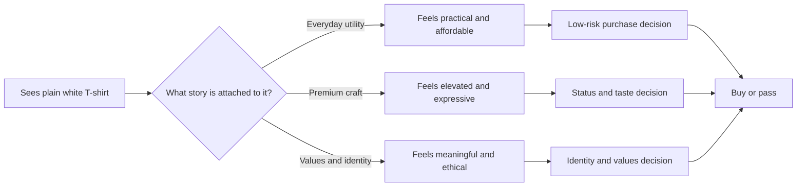

# Persuasion, Branding, and Design

A plain white T-shirt is a useful object. It is simple, inexpensive, and familiar. But a plain white T-shirt can also become a symbol of workwear, minimalism, luxury, activism, or rebellion depending on how it is framed. The shirt does not change. The meaning changes.

That is persuasion in action.

Persuasion is not just about getting someone to say yes. It is about shaping how a person pays attention, interprets a message, decides whether to trust it, and then acts. Designers do this all the time when they choose type, color, layout, language, context, and product placement. A persuasive design does not force a decision. It helps a person see a reason, connect a value, and feel confident enough to act.

This matters because people do not encounter products in a vacuum. They encounter them in a world crowded with signals. A person may see a T-shirt as a practical piece of clothing, a status symbol, a canvas for identity, or a statement of values. The same garment can support multiple stories, and the designer's job is often to help the right story become visible.

## What Persuasion Is—and Is Not

Persuasion is a tool for helping people form judgments. It can guide attention, interpretation, trust, and action. It can make a benefit clearer, a risk more understandable, or a choice more meaningful. In design and branding, persuasion often works through the arrangement of information, cues of credibility, emotional tone, and social context.

It is different from coercion and manipulation.

- Coercion uses force, threats, or pressure to remove real choice.
- Manipulation uses hidden influence, deceptive framing, or exploitation of confusion, fear, or dependency.
- Persuasion, by contrast, respects the person's ability to decide while making reasons, values, and consequences easier to understand.

A persuasive message may still be emotionally powerful. But if it is honest, respectful, and transparent, it is not the same as tricking someone into a decision they would not freely make.

The difference matters because persuasion is ethically useful when it helps people make informed choices. It becomes problematic when it distorts reality, exploits vulnerability, or hides what matters.

## A Recurring Example: One White T-Shirt, Many Messages

Imagine a plain white T-shirt sold in a basic storefront. It is cotton, simple, and easy to wear. Now imagine three different presentations of the exact same garment.

1. The everyday version: "A clean essential for everyday comfort." This frames the shirt as practical, versatile, and affordable.
2. The premium version: "A carefully made, small-batch cotton tee with a premium weave and artisanal finish." This frames the shirt as quality, craft, and taste.
3. The activist version: "Made in a worker-owned cooperative with transparent sourcing and fair wages." This frames the shirt as values, ethics, and identity.

The shirt itself is unchanged. What changes is the frame: the story, the implied value, the group identity, and the emotional promise the customer sees.

This is the heart of persuasion in branding and design. People do not buy a product only for raw function. They buy a product because it fits a story about who they are, what they value, or what they want to become.

## Robert Cialdini's Principles of Influence

One of the clearest introductions to persuasion comes from Robert Cialdini, whose work on influence focuses on patterns that repeatedly show up in human decision-making. His principles are not magic tricks; they are descriptions of common social tendencies. Used responsibly, they can improve communication. Used carelessly, they can become manipulation.

### 1. Reciprocity

People feel obligated to return favors, gifts, or kindness. If a brand gives something of value first, people often feel more inclined to respond in kind.

Example: A small free sample, a helpful consultation, or a generous newsletter can create goodwill. The product then feels less like a cold transaction and more like a relationship.

### 2. Commitment and Consistency

People like their choices to fit their self-image. Once someone has publicly committed to a value, idea, or action, they are more likely to act consistently with it.

Example: A customer who says, "I care about sustainable clothing," may be more likely to purchase a shirt marketed as ethical, especially if the purchase appears to align with their identity.

### 3. Social Proof

People look to others when they are uncertain. If a product appears popular, approved, or widely used, it can feel safer and more desirable.

Example: A white T-shirt may seem more trustworthy if it is presented as a bestseller, a community favorite, or part of a visible trend.

### 4. Authority

People are more likely to trust expertise, credentials, or signals of competence. Authority helps reduce uncertainty.

Example: A shirt described by a known craftsman, a recognized studio, or a clear production standard may feel more credible than a vague product page.

### 5. Liking

People are more responsive to people or brands they feel positively toward. Liking grows through familiarity, similarity, warmth, and relevance.

Example: A brand that feels friendly, culturally aligned, and aesthetically consistent can make a simple T-shirt feel worth buying.

### 6. Scarcity

People place more value on things that seem limited, time-sensitive, or hard to obtain. Scarcity creates urgency.

Example: "Only 30 produced" or "This drop ends Sunday" can create a sense that delay means missing out.

### 7. Unity

Cialdini later emphasized the role of shared identity and belonging. People are more influenced by others they see as part of their group or community.

Example: A shirt sold through a campus club, an independent artist community, or a local neighborhood brand can feel like participation in something larger than a purchase.

## Beyond Cialdini: Other Useful Ideas

Cialdini gives a strong foundation, but persuasion is broader than six or seven influencing patterns. Designers benefit from thinking about how people make decisions under uncertainty, emotion, attention limits, and social pressure.

### Framing and Loss Aversion

Behavioral economics teaches that people do not make decisions in a purely rational way. They respond strongly to how a choice is framed.

A classic idea is loss aversion: people feel the pain of losing something more strongly than the pleasure of gaining something of equal value. This means the same white T-shirt can be more persuasive when framed as avoiding a missed opportunity than as receiving a benefit.

For example:

- "Buy now before this edition sells out" emphasizes loss of opportunity.
- "Get your essential tee today" emphasizes a gain.

The shirt remains the same, but the frame changes the urgency and emotional weight.

### The Principle of Cognitive Ease

People prefer things that feel easy to understand and easy to trust. This is part of what makes clean design persuasive. When the message is clear, familiar, and low in friction, people are more likely to act.

A white T-shirt can be positioned as effortless because the copy is simple, the product page is uncluttered, and the visual language is consistent. Complexity often creates doubt. Simplicity can create confidence.

### Rhetorical Appeals: Ethos, Pathos, Logos

In rhetoric, persuasion often works through three appeals:

- Ethos: credibility and trust
- Pathos: emotion and connection
- Logos: reason and evidence

A brand can persuade by building ethos through craftsmanship and transparency, by using pathos through stories of community or identity, and by using logos through useful information like fabric details, pricing logic, or production standards.

The same white T-shirt can be sold as a practical essential, a personal expression, or a carefully reasoned product choice. Different appeals produce different kinds of trust.

## A Comparison Table

| Principle or idea | How it works | Ethical use | Misuse risk |
| --- | --- | --- | --- |
| Reciprocity | People feel pressure to return a gift or favor | Offer helpful samples, useful information, or genuine hospitality | Creating obligation through manipulation or hidden debt |
| Commitment and consistency | People want their actions to match their values | Encourage thoughtful choices that fit the user's identity | Pressuring someone into a decision they do not actually believe in |
| Social proof | People look to others for guidance | Share authentic reviews, evidence of community use, or transparent popularity | Fake testimonials, misleading trends, or false urgency |
| Authority | People trust expertise and credibility | Use clear credentials, transparent standards, and reliable expertise | Pretending to have authority without real knowledge |
| Liking | People respond better to familiar, warm, aligned brands | Build genuine connection through respectful design and audience understanding | Exploiting emotional attachment or using false familiarity |
| Scarcity | Limited availability increases urgency | Communicate real scarcity honestly | Artificial scarcity, fear-based pressure, or fake countdowns |
| Framing and loss aversion | Choice is shaped by how information is presented | Present tradeoffs clearly so the customer understands the stakes | Distorting context to make the buyer feel they must act immediately |
| Cognitive ease | Simplicity and clarity reduce uncertainty | Use clean, readable design and straightforward information | Over-simplifying important tradeoffs or hiding complexity |

## Decision Journey: How a T-Shirt Becomes a Choice

This diagram shows why the same shirt can lead to different outcomes. The product is fixed, but the meaning is not. Design and branding determine which story receives attention and how the decision is framed.

## Ethical Cautions

Persuasion is not inherently unethical. But the ethical danger appears when design crosses from informing into exploiting.

A few cautions matter:

- Do not hide important facts behind attractive language.
- Do not create false urgency when no real scarcity exists.
- Do not use fear in ways that pressure the user instead of helping them decide.
- Do not confuse popularity with quality.
- Do not rely on emotional manipulation when the product's real value is weak.
- Do not treat people as passive targets; respect their ability to think.

In branding, a lot of harm comes from making people feel bad about themselves unless they buy. That is not persuasion as a respectful communication tool. It is emotional pressure dressed as design.

A responsible designer asks: am I clarifying value, or am I manufacturing insecurity? Am I giving people useful information, or am I exploiting uncertainty?

## Questions to Ask Before Trying to Persuade

Before designing a persuasive message, a designer should ask:

- What is the real value I want to communicate?
- What assumptions am I making about the audience?
- Am I helping people understand the product, or am I simply amplifying desire?
- Is the information accurate, complete, and fair?
- What emotional triggers am I leaning on, and are they honest?
- Who benefits from this message, and who might be vulnerable to it?
- Am I using scarcity or social proof in a truthful way?
- Would this message still be acceptable if the audience knew exactly how it was designed?
- Does the product deserve the level of attention I am creating?
- Am I persuading people toward informed choice, or toward a decision they have not fully considered?

These questions matter because design is never neutral. It always shapes what people notice and how they interpret it. Good persuasion helps people make stronger judgments. Bad persuasion reduces them to impulse.

## Why This Matters in Design

Designers are not only arranging visual elements. They are arranging meaning. Every choice—type, image, spacing, language, pricing, context, and hierarchy—can influence how a product is interpreted.

That is why branding and persuasion are closely connected. A brand does not simply identify a product; it frames what the product means. The same white T-shirt can be sold as a blank canvas for self-expression or as a luxury statement piece, depending on how the message is built.

The ethical designer tries to be precise rather than performative. The goal is not to trick someone into wanting a product. The goal is to help the right person recognize why it matters.

## Explore Further

If you want to continue beyond this chapter, search for:

- "Cialdini principles of influence explained simply"
- "framing effect behavioral economics examples"
- "loss aversion in marketing"
- "ethos pathos logos examples in branding"
- "cognitive ease design psychology"
- "social proof in product design"
- "ethical persuasion vs manipulation in design"

These searches will lead to useful explanations without relying on fabricated sources or invented links.

## What You Should Remember

- Persuasion helps shape attention, interpretation, trust, and action.
- Persuasion is not the same as coercion or manipulation.
- Cialdini's principles—reciprocity, consistency, social proof, authority, liking, scarcity, and unity—are useful tools when used honestly.
- Design affects meaning as much as appearance; the same product can be framed in very different ways.
- Emotional intensity is not the same as ethical clarity.
- Good persuasion helps people make informed choices; bad persuasion exploits uncertainty and vulnerability.

A plain white T-shirt is a simple object, but it is never just a simple object. It becomes meaningful through the story we tell around it. That is the power of persuasion, and the responsibility of design.
