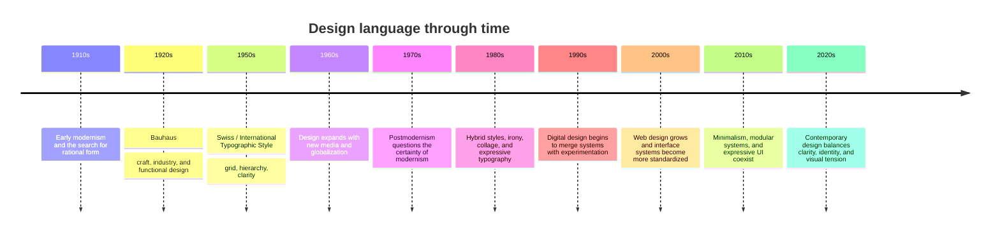

# Chapter 3: Design Language and the Meaning of Form

Design is not just decoration. It is a system of choices about structure, typography, spacing, color, rhythm, and hierarchy. These choices shape what a person notices first, what they understand quickly, and what kind of feeling or idea a product carries.

A visual design is a language. It does not simply show content; it gives content a tone, a posture, and a cultural position. Even a plain white T-shirt can feel radically different depending on how it is arranged in a composition: spare or crowded, orderly or playful, precise or ironic, minimal or excessive.

This chapter follows one central idea: design is always carrying meaning, even when it tries to seem neutral.

## Modernism: Order, Function, and Clarity

Early modernism emerged from a wider effort to rethink the relationship between form and purpose. In design, this often meant looking for clarity, logic, and efficiency. Designers increasingly treated visual systems as tools for communication rather than as decoration for its own sake.

Important modernist tendencies included:

- Clear hierarchy
- Strong grids
- Rational layout
- Objective, readable typography
- Function before ornament
- Reduction of unnecessary detail

This approach became particularly influential in the Bauhaus. The Bauhaus brought together craft, fine art, and industrial production. It argued that design should connect artistic thinking with practical making. The movement valued simple forms, disciplined structure, and the idea that design could serve everyday life.

From that tradition emerged the Swiss / International Typographic Style. This approach emphasized:

- asymmetrical layouts
- rigorous grids
- modular spacing
- sans-serif type
- strong visual hierarchy
- objective clarity
- neutrality used as a communicative strength

The Swiss style became especially important in graphic design, posters, signage, and information systems. Its obsession with order and legibility influenced modern web and product interfaces, even long after the original period ended.

A modernist design often says: “This is clear. This is useful. This is controlled.” That intention has a powerful appeal, especially in systems where trust and efficiency matter.

## Postmodernism: Disruption, Identity, and Irony

Postmodernism grew partly as a reaction against the certainty and control of modernism. If modernism often promised clarity, universality, and order, postmodernism questioned those assumptions. It suggested that design could also be playful, contradictory, personal, and culturally specific.

Postmodern design often embraces:

- disruption of rigid grids
- expressive typography
- collage and layering
- quotation of previous styles
- irony or contradiction
- identity over universality
- visual energy instead of calm neutrality

This does not mean postmodern design is simply “chaotic.” It is often deliberate and highly intentional. It asks: What happens when form resists the idea of perfect order? What if a design admits contradiction instead of hiding it?

The difference is important. Modernism often tries to make communication feel exact and universal. Postmodernism argues that communication is also cultural, emotional, and situated.

## The Ongoing Tension in Design

The real story is not that modernism ended and postmodernism replaced it. The history is more dynamic: design has continued to move between opposing tendencies.

| Tension | Modernist tendency | Postmodern tendency | Example in contemporary design |
| --- | --- | --- | --- |
| Order and disruption | Structure, alignment, clean systems | Breaking the grid, unexpected movement | Product pages that mix rigid layout with playful, irregular accents |
| Universality and identity | Simple forms for broad communication | Personal, local, cultural specificity | Brands using custom type and culturally coded visuals |
| Clarity and expression | Readability and hierarchy | Emotional tone and expressive form | Editorial layouts that combine crisp structure with strong personality |
| Grid and anti-grid | Structured modules | Collage, layering, offset blocks | Web design that mixes grids with asymmetrical cards and floating elements |
| Restraint and abundance | Less is more | More is more, layered and saturated | Interface designs balancing minimal navigation with rich visual density |
| Function and irony | Usefulness and purpose | Witty contradiction and visual commentary | Product marketing that uses humor, references, or exaggerated style |

This tension is not a historical footnote. It still appears in contemporary web design, product design, and branding. Many digital products today combine orderly systems with expressive detail. A calm interface may still include a bold accent color or unexpected illustration. A highly minimal brand may borrow a playful visual cue from a more ironic or experimental tradition.

## A Visual Timeline

This timeline is deliberately simple. It is meant to show a historical conversation rather than a single line of progress. Design does not move only from old to new. It keeps revisiting ideas and recombining them.

## How to Read a Design

If you want to understand a design, do not start by asking only, “Is it beautiful?” Instead, ask a few better questions:

1. What is the designer trying to make the viewer notice first?
2. What kind of order does the layout create?
3. Is the typography trying to feel neutral, authoritative, playful, or rebellious?
4. Does the work lean toward clarity, or does it want to disturb expectation?
5. What does the use of space, scale, and contrast suggest about the brand or message?
6. Is the design trying to feel universal, or is it emphasizing identity, culture, or voice?
7. Does the work seem functional, ironic, or both?

Design is readable in the same way a sentence is readable. You can study its rhythm, emphasis, and tone. A strong design does not just look appealing; it makes a point through arrangement and hierarchy.

## Modernist and Postmodern Presentations of the Same T-Shirt

The same plain white T-shirt can become two different products depending on the design language around it.

### A modernist presentation

A modernist version might show the shirt against a clean white background with careful spacing, a strict grid, neutral sans-serif typography, and a small set of highly legible details. The shirt looks precise, disciplined, and functional. It feels like a thoughtful essential designed for clarity and everyday use.

This presentation suggests:

- efficiency
- order
- reliability
- universality

The shirt feels like a clean object in a system.

### A postmodern presentation

A postmodern version might use collage, layered typography, asymmetry, bold color accents, playful contrast, and references to culture, art, or media. The same shirt appears expressive, ironic, and identity-driven. It feels less like a neutral staple and more like a cultural object with attitude.

This presentation suggests:

- personality
- disruption
- self-expression
- cultural commentary

The shirt feels like a statement, not just a garment.

The garment is identical. The visual language changes the meaning.

## Museum Research

Design history becomes more real when students look at authentic works in museum and institutional collections. Good research does not rely on guesses or a single website. It involves checking collections, verifying dates, and comparing how different institutions interpret the same style.

Use search terms such as:

- Bauhaus poster collection
- Swiss International Typographic Style posters
- modernist graphic design museum collection
- postmodern graphic design exhibition
- contemporary product design interface website design archive
- design history institutional collection search

Good places to begin include:

- The Metropolitan Museum of Art
- Museum of Modern Art (MoMA)
- Cooper Hewitt, Smithsonian Design Museum
- Victoria and Albert Museum (V&A)
- Bauhaus archives and related institutional collections
- Other credible museum and university design archives

When you search, follow these steps:

1. Identify the institution first.
2. Search for a collection category, not just a style name.
3. Check whether the object is a poster, book, digital interface, or designed object.
4. Confirm the date, creator, and context before drawing conclusions.
5. Compare multiple institutions so you are not relying on one interpretation.

Do not invent objects, dates, or claims. The goal is to observe evidence, compare examples, and learn how design language changes according to context.

## The Design Tension in Contemporary Practice

Contemporary design often blends the old arguments in new forms. A startup might use a highly structured grid and a restrained color palette while still adding a humorous illustration or a bold typography choice that breaks the expected rhythm. A luxury brand may present a product with careful minimalism but use a strong cultural reference or an ironic detail to suggest personality.

Design today rarely chooses one side completely. It often mixes:

- system with personality
- function with expression
- order with disruption
- universality with identity

The important principle is not “one style is right.” The important principle is that every design decision creates a tone and a message.

## What You Should Remember

- Design is a visual language, not just decoration.
- Modernism emphasized order, function, clarity, and reduction.
- Bauhaus and the Swiss / International Typographic Style made these ideas especially influential.
- Postmodernism reacted partly against modernist certainty by emphasizing disruption, identity, quotation, and expression.
- The tension between order and disruption, clarity and expression, and function and irony continues in contemporary design.
- The same plain white T-shirt can look like a disciplined essential or a cultural statement depending on the design language around it.
- The best way to learn design is to read its structure, hierarchy, tone, and context carefully and to compare real examples from credible collections.
