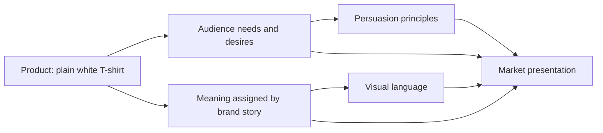

# Chapter 4: The Plain White T-Shirt Case Study

The plain white T-shirt is the perfect product for a design student because it is almost brutally simple. It is one object, but it invites an astonishing number of stories. That is exactly why it is useful.

The physical shirt is roughly the same in every version: a high-quality cotton tee, comfortable fit, clean neckline, decent weight, durable stitching. It is not magical. It is not a luxury artifact by itself. It is a shirt.

The magic happens when a brand decides what that shirt means.

This chapter takes one imaginary physical product and gives it four radically different market identities. The shirt stays mostly the same. The audience, message, persuasion strategy, and visual language change. The result is not four separate products in a literal manufacturing sense. It is four ways of presenting the same object as a different kind of value.

## The Shirt, in Broad Terms

The base product:

- ordinary high-quality plain white T-shirt
- soft cotton, good fit, durable construction
- neutral color and simple silhouette
- made to be worn often and washed repeatedly

This is not a gimmick product. It is not a poster for a trend. It is a blank, useful object. That is exactly why it works as a case study: its emptiness becomes a space for meaning.

A shirt can be sold as a tool, a signal, a comfort object, a rebellion, a ritual, or a status symbol. It can promise clarity, freedom, belonging, premium taste, or a bit of chaos. The same fabric becomes a different story depending on who is telling it.

## Concept 1: The Explorer — “Go Where the Day Takes You”

### Audience
- Students, freelancers, travelers, people who like movement and unstructured life
- People who prefer utility and improvisation over polish

### Brand archetype
- Explorer

### Persuasion principles being used
- Social proof through “outdoor-tested” or “city-moving” authenticity
- Scarcity through limited seasonal release
- Liking through a relaxed, authentic tone

### Visual-design language
- Modern or near-minimal, but with environmental texture and soft ruggedness
- Neutral palette with dusty earth tones, muted blues, and subtle weathered imagery
- Clean hexagonal layout, outdoor photography, easy open space

### Headline
- “Made for the road, the studio, and the long way home.”

### Short product story
This shirt is for people who want to move without fuss. It is durable enough for the day, comfortable enough for a late train ride, and simple enough to wear from a morning walk to a café to an evening meeting. It does not scream for attention. It just helps the wearer keep moving.

### Imagery direction
Wide landscapes, worn leather, early morning streets, city light, a shirt folded into a backpack, a person on a train platform or path. The styling reads as lived-in and practical rather than luxury-heavy.

### What meaning the customer is actually being invited to buy
The customer is not simply buying a T-shirt. They are buying a feeling of mobility, independence, and competence. The shirt promises readiness for the unexpected. It allows the buyer to imagine themselves as capable, unbothered, and unconstrained.

### Ethical concern or possible misuse
The risk is that this positioning may imply a lifestyle that some people cannot actually afford or access. The shirt may also be sold as “authentic” or “free-spirited” in a way that romanticizes adventure while hiding the fact that it is still an ordinary shirt.

## Concept 2: The Sage — “A Better Basic for a Thoughtful Life”

### Audience
- Professionals, students, office workers, people who value order, quality, and self-control
- Buyers who prefer minimalism and clarity over dramatic branding

### Brand archetype
- Sage

### Persuasion principles being used
- Authority through material honesty and clear fit information
- Commitment and consistency through the idea of a “capsule wardrobe”
- Social proof from practical reviews and fit details

### Visual-design language
- Restrained modernist / Swiss-influenced design language
- Strong grid, asymmetrical balance, sparse typography, precise spacing
- High legibility, understated neutral palette, text-first presentation

### Headline
- “The essential shirt for a deliberate wardrobe.”

### Short product story
This is the shirt for the person who has decided to own fewer but better things. It is not loud. It is not trying to become a personality trait. It is a reliable foundation, carefully cut and clearly explained. The point is not drama; it is considered life.

### Imagery direction
A white studio background, carefully spaced product shots, a neutral color palette, close-ups of fabric texture, fit diagrams, a measured layout. The shirt appears as an object of clarity rather than performance or personality.

### What meaning the customer is actually being invited to buy
The customer is buying a version of themselves as thoughtful, intentional, and organized. The shirt promises competence and clarity rather than spectacle. The meaning is “I know what matters. I choose fewer things, and I choose well.”

### Ethical concern or possible misuse
This style can become subtly elite or superior. It may imply that someone is “better” if they buy fewer items or adopt a minimalist lifestyle. It can also hide the fact that minimalism is a choice shaped by privilege, resources, and access.

## Concept 3: The Rebel — “Wear the Shirt, Break the Script”

### Audience
- Young adults, artists, students, creative workers, anyone who wants to signal independence
- People who enjoy anti-establishment identity and cultural tension

### Brand archetype
- Rebel

### Persuasion principles being used
- Scarcity and urgency
- Social proof through cultural visibility and community signaling
- Liking through a strong voice and attitude

### Visual-design language
- Disruptive or postmodern visual language
- Asymmetrical pages, aggressive typography, layering, collage, visual contradiction
- Bold contrast, irregular spacing, oversized text, intentionally rough edges

### Headline
- “Not a uniform. A disruption.”

### Short product story
This shirt is for people who do not want to blend in. It is not made for comfort alone. It is made for expression, shock, and social friction. The brand speaks in a voice that resists polish and refuses to look harmless. This shirt says, “I am not pretending to be conventional.”

### Imagery direction
Textural collage, broken grids, harsh color contrasts, rough surfaces, urban signage references, bold confrontation, photos with tension, maybe a shirt partially hidden in an arrangement of fragments or graffiti-like overlays.

### What meaning the customer is actually being invited to buy
The buyer is not just buying a shirt. They are buying a way of showing defiance. The shirt promises identity, edge, and cultural distinction. It invites the wearer to feel more alive, more visible, and less compliant.

### Ethical concern or possible misuse
This style can turn rebellion into performative antagonism. It may also rely on social pressure, implying that refusing the shirt means accepting conformity or lack of creativity. It can become a tactic of provocation rather than a genuine expression of values.

## Concept 4: The Caregiver — “Soft Enough to Live In”

### Audience
- People who care about comfort, daily rituals, and practical softness
- Buyers who want a dependable wardrobe for ordinary life
- Families, caregivers, remote workers, and people who value ease over spectacle

### Brand archetype
- Caregiver

### Persuasion principles being used
- Reciprocity through helpful product care advice
- Liking through warmth and accessibility
- Authority through honest material explanation and practical details

### Visual-design language
- Warm, domestic, reassuring, highly readable
- Soft color palette, rounded forms, generous spacing, gentle imagery of home life or daily comfort
- Not necessarily minimalist, but calm and welcoming

### Headline
- “The shirt that makes everyday easier.”

### Short product story
The shirt is built for ordinary life. It is worn while making coffee, walking to work, sitting at a desk, and folding into a routine that does not require a costume change. It prioritizes softness, reliability, and comfort. It is a wearable version of ease.

### Imagery direction
Home scenes, natural light, soft fabric close-ups, domestic rituals, people lounging, reading, preparing food, remote work, or sitting quietly. The emotional tone is gentle, not glamorous.

### What meaning the customer is actually being invited to buy
The customer is buying stability and ease. The product promises care without performance. It suggests that they are someone who values comfort, consistency, and the emotional comfort of ordinary life. This is not a dramatic transformation; it is daily relief.

### Ethical concern or possible misuse
This concept risks moralizing everyday comfort as a virtue. It may also lean heavily on warmth and reliability in a way that hides labor and production issues. The shirt is presented as a safe choice, but that comfort can be sentimentalized rather than honestly explained.

## Concept 5: The Magician — “Wear the Beginning of a New Version of You”

### Audience
- People who want transformation, self-invention, or symbolic reinvention
- Creatives, ritual users, and people attracted to identity shifts

### Brand archetype
- Magician

### Persuasion principles being used
- Authority through a story of transformation
- Social proof through aspirational community or influencer presence
- Scarcity through collectible or seasonal drops

### Visual-design language
- Highly expressive, atmospheric, cinematic, and stylized
- Dramatic lighting, layered gradients, unusual typography, ritual-like staging
- Rich visual world rather than practical product clarity

### Headline
- “A blank shirt for the version of you that is about to arrive.”

### Short product story
This is the shirt for endings and beginnings. The product is presented as a threshold object: the garment you wear before a new chapter starts. It is more than fabric; it is a ritual prop for reinvention. It tells the story of change, not comfort or utility.

### Imagery direction
Low-key lighting, dramatic shadows, circular compositions, mysterious product setups, symbolic props such as notebooks, mirrors, light, or transitions. The scene should feel ceremonial and transformative rather than plain.

### What meaning the customer is actually being invited to buy
The customer is buying possibility. They are invited to imagine themselves as someone who can change, upgrade, or become a new version of themselves. The shirt symbolizes a threshold where identity shifts.

### Ethical concern or possible misuse
This positioning can become inflated or manipulative. It promises transformation in a way that may obscure the fact that the product is still just a shirt. It risks turning self-esteem into a superficial purchase fantasy.

## Synthesis Table

| Concept | Audience | Archetype | Persuasion principles | Visual language | Meaning being sold | Ethical risk |
| --- | --- | --- | --- | --- | --- | --- |
| Explorer | Travelers, students, mobile workers | Explorer | Social proof, scarcity, liking | Rugged minimalism with natural textures | Freedom, mobility, readiness | Romanticizing movement while hiding ordinary materiality |
| Sage | Minimalists, professionals, careful shoppers | Sage | Authority, consistency, social proof | Swiss-influenced modernism | Clarity, intentionality, competence | Can imply superiority or elitism |
| Rebel | Young creatives, anti-conformists | Rebel | Scarcity, social proof, liking | Postmodern disruption | Defiance, identity, edge | Provocation can become performative or exclusionary |
| Caregiver | Everyday consumers, home-oriented buyers | Caregiver | Reciprocity, liking, authority | Warm domestic design | Ease, comfort, reliability | Comfort can be sentimentalized or ethically simplified |
| Magician | Identity seekers, creative self-transformers | Magician | Authority, social proof, scarcity | Cinematic, expressive, atmospheric | Reinvention, possibility, transition | Inflated promise of transformation |

## How the Elements Combine

This diagram is useful because it shows that the shirt is only the starting point. A market presentation is built by combining the product with a target audience, a chosen promise, a persuasive method, and an aesthetic form. None of those pieces acts alone.

## Why the Shirt Works as a Case Study

The plain white T-shirt is valuable because it is almost empty. It has almost no built-in story. That emptiness creates room for design. It allows a brand to decide what kind of person the product is for and what kind of self the buyer is invited to inhabit.

This is one of the best lessons in branding: a product can be ordinary and still be made memorable by the meaning around it.

A basic T-shirt becomes a statement when a brand decides its social script. It becomes a premium essential when a brand aligns it with care, discipline, and restraint. It becomes a counter-cultural artifact when a brand chooses disruption, edge, and tension. It becomes a ritual object when a brand frames it as a beginning rather than a garment.

That is not trickery. It is the real work of design and persuasion.

## What You Should Remember

- The same physical product can carry many different meanings depending on audience, message, and visual language.
- Brand archetypes help define the emotional role the product is meant to play.
- Persuasion is not only about pressure; it is about framing, relevance, and trust.
- Design language shapes meaning as strongly as copy does.
- A plain white T-shirt is a useful case study because it is so simple that the story becomes visible.
- Ethical marketing asks whether the promise is honest, fair, and respectful of the buyer’s real decision-making.
- The most powerful product presentations do not invent a different shirt. They tell a different story about the same one.
