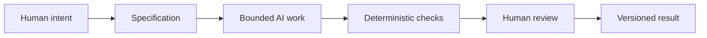

# Chapter 5: Synthesis — Persuasion, Meaning, Design, and AI

The earlier chapters were not separate topics. They were three ways of asking the same basic question: what is this thing trying to become?

- Persuasion helps answer: what response are we trying to enable?
- Archetype helps answer: what meaning or identity are we expressing?
- Design language helps answer: how should that meaning look and feel?

Taken together, these three lenses form a useful control framework. They help explain not only how brands communicate, but also how creative and technical work can be directed with more intention.

This matters because modern work is rarely just one decision. A product page, a poster, a landing page, a data dashboard, a research memo, or a code comment all involve decisions about audience, meaning, and presentation. The same is true for AI-assisted work.

If you give an AI system a vague brief, it will often produce something fast but not necessarily something careful. If you give it a clear specification, a target audience, a desired feeling, and visible constraints, the output becomes more useful.

That is the point of this framework.

## A Simple Control Framework

Think of the work as a chain of decisions:

1. What do we want the audience to do or feel?
2. What kind of meaning or identity are we trying to express?
3. How should that meaning appear in structure, language, and visual form?

The answers to those questions provide direction before the first line of code or the first draft sentence is produced.

This is not unlike designing a T-shirt campaign. If the product is a plain white T-shirt, the team must decide whether the audience is being invited toward movement, clarity, rebellion, comfort, or reinvention. Once the story is clear, the visual language can support it. The persuasion strategy then helps decide what response is expected: trust, urgency, curiosity, belonging, or calm confidence.

The same principle applies to AI-assisted work.

## Why a Task Needs a Specification

An AI system is a probabilistic tool. It can generate ideas quickly, but it does not automatically know the boundaries of a task. Without a specification, it is left to guess what the user values, what counts as success, and what should be left out.

A good specification should include:

- the goal
- the intended audience
- the desired tone and style
- constraints such as word count, file format, or platform
- required evidence or content boundaries
- what should be avoided

This is not bureaucracy for its own sake. It is how a task becomes clear enough to be executed well.

The specification acts like a brief for a team. It narrows the possible versions and makes evaluation easier. Without a specification, AI output may look polished but still miss the real brief.

That is why bounded AI work matters. A task is easier to direct when it has a defined scope, a clear success condition, and a way to measure whether the output fits the intended purpose.

## Why Version Control Matters

When AI is generating work, especially in writing and coding, the output can change fast. A model may suggest several variations in a single session. Without a robust versioning method, it becomes hard to tell which version was right, what changed, and whether something important was accidentally lost.

This is where Git becomes valuable. Git gives the project a timeline. It records changes, supports recovery, and lets a team compare versions deliberately.

In practical terms, Git provides:

- traceability: you can see what changed and when
- recovery: you can return to an earlier state if a change is wrong
- review: a person can inspect differences instead of guessing the final state
- collaboration: multiple people can work without losing a shared thread of decision-making

The same logic applies to AI output. If a model drafts an essay, a design brief, or a code file, version control creates a record of the work. It turns a loose conversation into a manageable artifact.

## Why Deterministic Checks Matter

Not every part of creative work can be reduced to a single pass/fail rule, but many tasks still benefit from deterministic checks. These are automated validations that can be run cheaply and repeatedly.

Examples include:

- checking that a file exists
- verifying the Markdown structure
- ensuring required headings are present
- confirming links or filenames are valid
- running tests for code
- verifying formatting or lint rules

Deterministic checks are valuable because they are cheap, repeatable, and objective. They catch simple mistakes quickly before a human spends time reviewing the full output.

This is similar to a race-car pit stop: the crew can do fast, repeatable checks while the car is still in motion, without stopping the whole operation. The goal is not to replace human thinking. It is to keep the system moving smoothly and to catch obvious problems early.

## Why AI Review Is Useful but Probabilistic

AI review can be useful. It can point out missing sections, weak structure, ambiguous language, or incomplete requirements. It can help detect patterns that a person might overlook. A second AI pass can act like a quick editorial assistant.

But AI review is probabilistic. It does not mean “this is true” or “this is definitely right.” It means the system is generating a likely answer based on patterns it has seen. That answer may be plausible while still being incomplete, subtly wrong, or misleading in context.

This is why AI review should be treated as a support, not a final authority.

The human must still ask:

- Is this relevant to the actual task?
- Does it match the audience and purpose?
- Is it truthful and fair?
- Does it fit the context?
- Does the output carry meaning beyond generic fluency?

A good workflow uses AI where it is strong—speed, variation, pattern recognition, synthesis—and keeps humans at the points where judgment matters most.

## The Pit-Stop Metaphor

A race team does not ask every worker to inspect every detail at every moment. The process is organized. Some tasks are done in a fast rhythm; some moments require close inspection.

The same is true for AI-assisted work.

- Automation can keep running through routine checks, formatting, file creation, and pattern validation.
- Human review should happen at selected moments: when meaning is unclear, when truthfulness is at stake, when the audience is important, and when a decision could change direction or responsibility.

This is not a sign of distrust. It is a sign of design. The human is not the “undo button.” The human is the source of judgment, context, and meaning.

## Human Responsibility Remains Central

Even in a well-managed AI workflow, humans remain responsible for:

- intent: deciding what problem is actually being solved
- judgment: deciding what matters and what matters less
- truthfulness: verifying claims, evidence, and factual accuracy
- context: understanding audience, culture, and setting
- final decisions: accepting, editing, rejecting, or revising the output

AI can produce options quickly, but AI is not the ultimate authority on meaning. It does not understand the full social or ethical context the way a person can. It does not replace the human obligation to decide what is appropriate, truthful, and useful.

That is why the final workflow is not “AI does everything.” It is “AI helps within a bounded system, and humans remain accountable for the final result.”

## The Complete Workflow

This diagram captures the practical idea: the work should not begin with a vague request and end with a vague answer. It should begin with intent and become a structured process that includes validation and review.

## Why This Framework Matters for Design and AI

The three lenses from earlier chapters now become a workflow for creative and technical work.

- Persuasion tells us what reaction we want to enable.
- Archetype tells us what identity or meaning we are expressing.
- Design language tells us how that meaning should look and feel.

When combined with AI, these lenses help define the task more clearly. They prevent the common problem where AI output feels fluent but lacks direction. They also help a human team maintain clarity about purpose, not just productivity.

This matters because a tool can be fast without being good. Good work requires a purpose, a framework, and a human who is willing to take responsibility for the result.

## Questions for Next Week

- How could you apply this framework to a real design brief or writing task?
- What would a good specification look like for a small AI-assisted project?
- Where in a workflow should automation stop and human review begin?
- Which examples from this book feel most useful in your own work?
- How do you decide whether a persuasive message is ethical or manipulative?

## What You Should Remember

- Persuasion answers the question: what response are we trying to enable?
- Archetype answers: what meaning or identity are we expressing?
- Design language answers: how should that meaning look and feel?
- AI work should be bounded by a clear specification to reduce drift and confusion.
- Git gives traceability, recovery, and a record of decisions.
- Deterministic checks provide cheap, repeatable validation.
- AI review can help but should not be treated as final truth.
- Humans remain responsible for judgment, meaning, context, and final decisions.
- Good creative work is not just faster; it is more intentional, better constrained, and more accountable.
